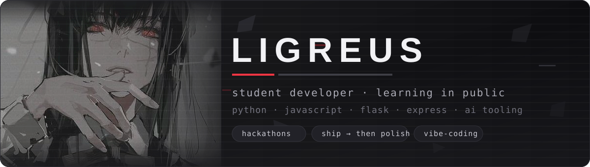

  

  
  
  

---

### About

I'm a student learning to build software by shipping it. Most of what you see here started as a
weekend idea, a practice task, or a hackathon prototype — small web apps, AI-assisted tools, and
experiments that taught me something even when they didn't survive.

My rule of thumb: **deploy first, get clever later.** A working public URL on day one beats a
perfect codebase nobody can open.

### What I'm working on

- Building small web apps with **Flask** and **Express**, deployed on **Render**
- Learning where an LLM genuinely helps — and where plain deterministic rules do the job better
- Preparing for hackathons: a reusable project template, deploy in under an hour, a demo that holds up

### Tech Stack

**Languages**

**Backend & data**

**Tooling**

  
  
  
  
  
  
  
  

### Projects

| Project | What it is | Built with |
| --- | --- | --- |
| [EnergyMind-AI](https://github.com/logreus-cloud/EnergyMind-AI) | AI-assisted web application | JavaScript |
| [BizHakAI](https://github.com/logreus-cloud/BizHakAI) | Hackathon project — business tooling with AI | Python |
| [HealthTrackerFlask](https://github.com/logreus-cloud/HealthTrackerFlask) | Health tracking app with a Flask backend | Flask · JS |
| [zauchivanie-koda](https://github.com/logreus-cloud/zauchivanie-koda) | Small drill app for memorizing code by typing it | Python |
| [KaspiPracticeKhakaton](https://github.com/logreus-cloud/KaspiPracticeKhakaton) | Hackathon practice run | — |

### Learning next

`testing` · `databases beyond SQLite` · `CI that actually runs` · `reading other people's code`

<b>По-русски</b>

### О себе

Студент. Учусь разрабатывать, разрабатывая: почти всё здесь начиналось как идея на выходные,
учебная задача или прототип с хакатона — небольшие веб-приложения, инструменты с ИИ и
эксперименты, которые чему-то научили, даже если не выжили.

Принцип простой: **сначала деплой, потом красота.** Рабочая публичная ссылка в первый день
полезнее идеального кода, который никто не может открыть.

### Чем занят сейчас

- Собираю небольшие веб-приложения на **Flask** и **Express**, деплою на **Render**
- Разбираюсь, где языковая модель действительно помогает, а где обычные детерминированные правила работают лучше
- Готовлюсь к хакатонам: переиспользуемый шаблон проекта, деплой меньше чем за час, демо, которое не разваливается

### Стек

**Языки**

**Бэкенд и данные**

**Инструменты**

  
  
  
  
  
  
  
  

### Проекты

| Проект | Что это | Стек |
| --- | --- | --- |
| [EnergyMind-AI](https://github.com/logreus-cloud/EnergyMind-AI) | Веб-приложение с ИИ | JavaScript |
| [BizHakAI](https://github.com/logreus-cloud/BizHakAI) | Хакатонный проект: бизнес-задачи и ИИ | Python |
| [HealthTrackerFlask](https://github.com/logreus-cloud/HealthTrackerFlask) | Трекер здоровья, бэкенд на Flask | Flask · JS |
| [zauchivanie-koda](https://github.com/logreus-cloud/zauchivanie-koda) | Тренажёр для заучивания кода набором вручную | Python |
| [KaspiPracticeKhakaton](https://github.com/logreus-cloud/KaspiPracticeKhakaton) | Тренировочный хакатон | — |

### Что учу дальше

`тесты` · `базы данных сложнее SQLite` · `CI, который реально запускается` · `чтение чужого кода`

  Always mid-project — say hi if anything here is useful to you

