

  <picture>
    <source srcset="./assets/banner.svg" media="(prefers-color-scheme: dark)">
    <source srcset="./assets/banner-light.svg" media="(prefers-color-scheme: light), (prefers-color-scheme: no-preference)">
    
  </picture>

  <a href="https://logreus-cloud.github.io/portfolio/"><picture><source srcset="./assets/link-portfolio.svg" media="(prefers-color-scheme: dark)"><source srcset="./assets/link-portfolio-light.svg" media="(prefers-color-scheme: light), (prefers-color-scheme: no-preference)">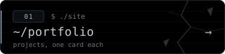</picture></a>
  <a href="https://triage-web-eaj2.onrender.com/"><picture><source srcset="./assets/link-demo.svg" media="(prefers-color-scheme: dark)"><source srcset="./assets/link-demo-light.svg" media="(prefers-color-scheme: light), (prefers-color-scheme: no-preference)">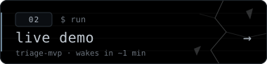</picture></a>
  <a href="https://github.com/logreus-cloud?tab=repositories"><picture><source srcset="./assets/link-repos.svg" media="(prefers-color-scheme: dark)"><source srcset="./assets/link-repos-light.svg" media="(prefers-color-scheme: light), (prefers-color-scheme: no-preference)">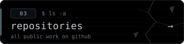</picture></a>

I'm a student who learns software by shipping it — small web apps, AI-assisted tools and hackathon prototypes, each one with a public URL before it gets clever.

  <picture>
    <source srcset="./assets/rule.svg" media="(prefers-color-scheme: dark)">
    <source srcset="./assets/rule-light.svg" media="(prefers-color-scheme: light), (prefers-color-scheme: no-preference)">
    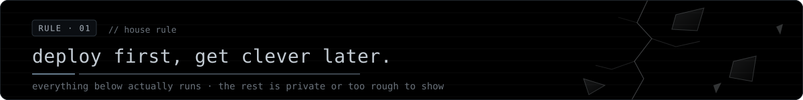
  </picture>

Found something useful, or need one more person for a hackathon team? Open an issue in any repo and say hi.

### About

Most of it started as a weekend idea, a practice task or a hackathon prototype, and each one taught me something even when it didn't survive. A working public URL on day one beats a perfect codebase nobody can open.

### What I'm working on

- Building small web apps with **Flask** and **Express**, deployed on **Render** and **Cloudflare Pages**
- Learning where an LLM genuinely helps — and where plain deterministic rules do the job better
- Writing the core parts myself instead of configuring them: a BM25 search engine, a Markdown → DOCX pipeline
- Preparing for hackathons: a reusable project template, deploy in under an hour, a demo that holds up

### Tech Stack

<picture>
  <source srcset="./assets/stack.svg" media="(prefers-color-scheme: dark)">
  <source srcset="./assets/stack-light.svg" media="(prefers-color-scheme: light), (prefers-color-scheme: no-preference)">
  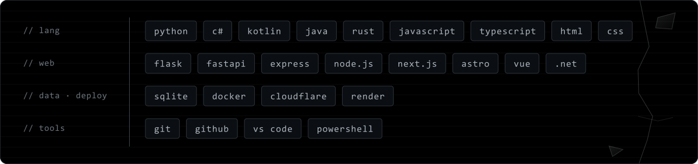
</picture>

### Projects

  <a href="https://github.com/logreus-cloud/genshinflex"><picture><source srcset="./assets/cards/genshinflex.svg" media="(prefers-color-scheme: dark)"><source srcset="./assets/cards/genshinflex-light.svg" media="(prefers-color-scheme: light), (prefers-color-scheme: no-preference)">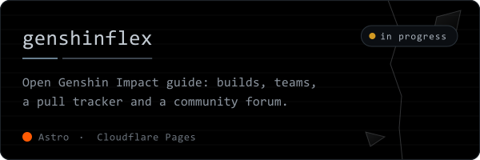</picture></a>
  <a href="https://github.com/logreus-cloud/notabene"><picture><source srcset="./assets/cards/notabene.svg" media="(prefers-color-scheme: dark)"><source srcset="./assets/cards/notabene-light.svg" media="(prefers-color-scheme: light), (prefers-color-scheme: no-preference)">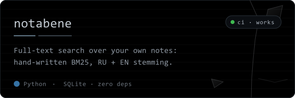</picture></a>

  <a href="https://github.com/logreus-cloud/labgen"><picture><source srcset="./assets/cards/labgen.svg" media="(prefers-color-scheme: dark)"><source srcset="./assets/cards/labgen-light.svg" media="(prefers-color-scheme: light), (prefers-color-scheme: no-preference)">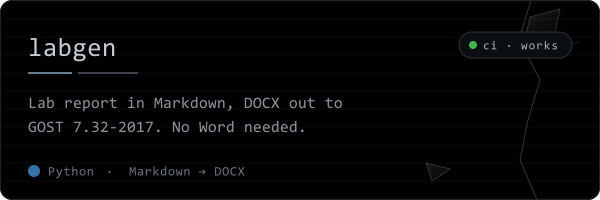</picture></a>
  <a href="https://github.com/logreus-cloud/triage-mvp"><picture><source srcset="./assets/cards/triage-mvp.svg" media="(prefers-color-scheme: dark)"><source srcset="./assets/cards/triage-mvp-light.svg" media="(prefers-color-scheme: light), (prefers-color-scheme: no-preference)">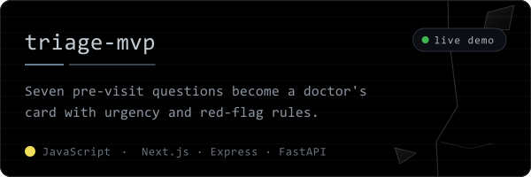</picture></a>

  <a href="https://github.com/logreus-cloud/analog-prep"><picture><source srcset="./assets/cards/analog-prep.svg" media="(prefers-color-scheme: dark)"><source srcset="./assets/cards/analog-prep-light.svg" media="(prefers-color-scheme: light), (prefers-color-scheme: no-preference)">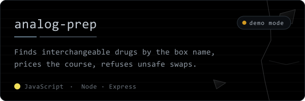</picture></a>
  <a href="https://github.com/logreus-cloud/HealthTrackerFlask"><picture><source srcset="./assets/cards/healthtrackerflask.svg" media="(prefers-color-scheme: dark)"><source srcset="./assets/cards/healthtrackerflask-light.svg" media="(prefers-color-scheme: light), (prefers-color-scheme: no-preference)">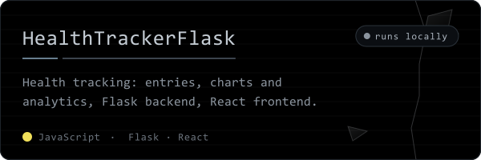</picture></a>

Live demo: [triage-mvp](https://triage-web-eaj2.onrender.com/) (free Render plan, first load takes up to a minute) · also on GitHub: [EnergyMind-AI](https://github.com/logreus-cloud/EnergyMind-AI), [portfolio](https://github.com/logreus-cloud/portfolio)

<picture>
  <source srcset="./assets/activity.svg" media="(prefers-color-scheme: dark)">
  <source srcset="./assets/activity-light.svg" media="(prefers-color-scheme: light), (prefers-color-scheme: no-preference)">
  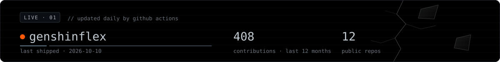
</picture>

### Learning next

`testing` · `databases beyond SQLite` · `CI that actually runs` · `reading other people's code`

<b>По-русски</b>

Я студент и учусь разработке, выпуская проекты: небольшие веб-приложения, инструменты с ИИ и прототипы с хакатонов. У каждого появляется публичная ссылка раньше, чем красивый код.

  <picture>
    <source srcset="./assets/rule-ru.svg" media="(prefers-color-scheme: dark)">
    <source srcset="./assets/rule-ru-light.svg" media="(prefers-color-scheme: light), (prefers-color-scheme: no-preference)">
    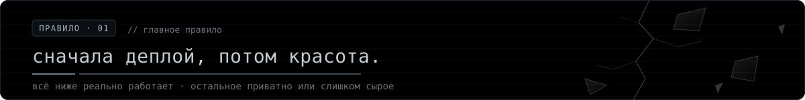
  </picture>

Нашли что-то полезное или нужен ещё один человек в команду на хакатон? Откройте issue в любом репозитории и напишите.

### О себе

Почти всё здесь начиналось как идея на выходные, учебная задача или прототип с хакатона, и каждый проект чему-то научил, даже если не выжил. Рабочая публичная ссылка в первый день полезнее идеального кода, который никто не может открыть.

### Чем занят сейчас

- Собираю небольшие веб-приложения на **Flask** и **Express**, деплою на **Render** и **Cloudflare Pages**
- Разбираюсь, где языковая модель действительно помогает, а где обычные детерминированные правила работают лучше
- Пишу ключевые части сам, а не настраиваю готовые: поисковый движок на BM25, конвейер Markdown → DOCX
- Готовлюсь к хакатонам: переиспользуемый шаблон проекта, деплой меньше чем за час, демо, которое не разваливается

### Стек

<picture>
  <source srcset="./assets/stack.svg" media="(prefers-color-scheme: dark)">
  <source srcset="./assets/stack-light.svg" media="(prefers-color-scheme: light), (prefers-color-scheme: no-preference)">
  
</picture>

### Проекты

| Проект | Что это | Стек | Состояние |
| --- | --- | --- | --- |
| [notabene](https://github.com/logreus-cloud/notabene) | Полнотекстовый поиск по своим заметкам из терминала или вкладки браузера. Ранжирование BM25 написано вручную, стемминг для русского и английского, поиск по фразе — один файл SQLite и ноль зависимостей | Python · SQLite | CI · работает |
| [labgen](https://github.com/logreus-cloud/labgen) | Пишешь отчёт по лабе в Markdown — получаешь DOCX по ГОСТ 7.32-2017: нумерация рисунков и таблиц, содержание, Word не нужен | Python | CI · работает |
| [triage-mvp](https://github.com/logreus-cloud/triage-mvp) | Предварительный опрос пациента: семь вопросов превращаются в карточку для врача с категорией срочности и правилами тревожных признаков | Next.js · Express · FastAPI | [живая ссылка](https://triage-web-eaj2.onrender.com/) |
| [analog-prep](https://github.com/logreus-cloud/analog-prep) | Поиск аналогов лекарств: по названию с упаковки находит взаимозаменяемые препараты, считает цену за курс и запрещает замену там, где правила считают её опасной | Node · Express | хакатон · демо-режим |
| [genshinflex](https://github.com/logreus-cloud/genshinflex) | Открытый справочник по Genshin Impact: билды, команды, база персонажей, трекер круток и проверка команды для Бездны под текущую ротацию | Astro · Cloudflare Pages | в работе |
| [HealthTrackerFlask](https://github.com/logreus-cloud/HealthTrackerFlask) | Трекер здоровья: записи, графики и аналитика, бэкенд на Flask и фронтенд на React | Flask · React | работает локально |
| [EnergyMind-AI](https://github.com/logreus-cloud/EnergyMind-AI) | Приложение с ИИ вокруг энергетики: раздельные фронт и бэк, общий контракт API, Docker Compose | JavaScript · Docker | в работе |

### Что учу дальше

`тесты` · `базы данных сложнее SQLite` · `CI, который реально запускается` · `чтение чужого кода`

## [github.com/logreus-cloud/genshinflex](https://github.com/logreus-cloud/genshinflex) my longest-running build — an open Genshin guide: builds, teams, a pull tracker and a community forum.

> The same projects, one card each, live on [the portfolio site](https://logreus-cloud.github.io/portfolio/).
